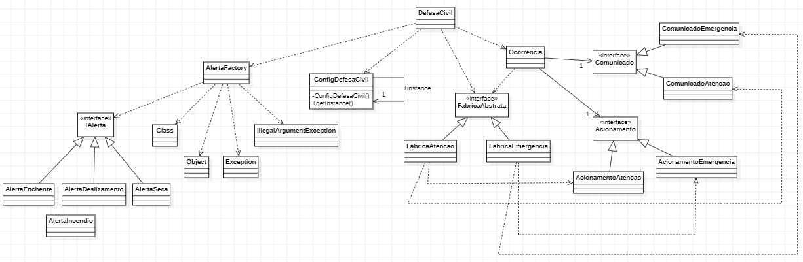

# Desafio integração de padrões Singleton, Factory Method, Abstract Factory, Sistema de Alertas da Defesa Civil

#### Nome: João Vitor Fernandes Ribeiro Carneiro Ramos
#### Matrícula: 202165076C

Implementação dos padrões de projeto **Singleton**, **Factory Method**, **Abstract Factory** em Java.

## Diagrama UML

